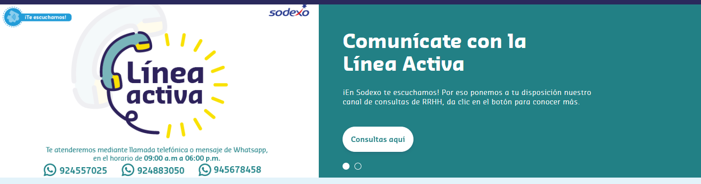

## /Inicio
* Banner principal
> Estilos, altura, márgenes, estructura de clases html, versión mobil

* Sliders principales
> reestructuramiento, reparación de referencias y solución para los botones de adelante y atrás, versión mobil

![[image02.png]]

* Oportunidades laborales
> Creación completa de esta sección, así como sus formularios y modales internos, versión mobil

![[image03.png]]

* Footer
> Version mobil styles y demas

![[image04.png]]
